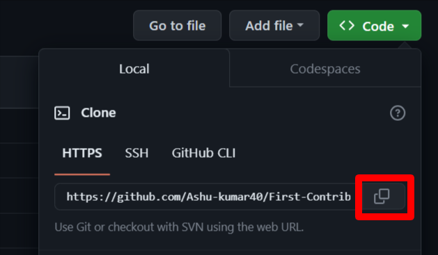

# First Contributions

This project aims to simplify and guide the way beginners make their first contribution. If you are looking to make your first contribution, follow the steps below.


#### If you don't have git on your machine, [install it](https://help.github.com/articles/set-up-git/).

## Fork this repository


Fork this repository by clicking on the fork button on the top of this page.
This will create a copy of this repository in your account.
<br/>
<br/>
<br/>
<br/>

## Clone the repository


Now clone the forked repository to your machine. Go to your GitHub account, open the forked repository, click on the code button and then click the _copy to clipboard_ icon.

Open a terminal and run the following git command:

```
git clone "url you just copied"
```

where "url you just copied" (without the quotation marks) is the url to this repository (your fork of this project). See the previous steps to obtain the url.



For example:

```
git clone https://github.com/Ashu-kumar40/First-Contribution-MLSA.git
```

where `this-is-you` is your GitHub username. Here you're copying the contents of the first-contributions repository on GitHub to your computer.

## Create a branch

Change to the repository directory on your computer (if you are not already there):

```
cd First-Contribution-MLSA
```

Now create a branch using the `git switch` command:

```
git switch -c your-new-branch-name
```

For example:

```
git switch -c branch-your-name
```

## Make necessary changes and commit those changes

Now open `Contributors.md` file in a text editor, add your name to it. Don't add it at the beginning or end of the file. Put it anywhere in between. Now, save the file.


If you go to the project directory and execute the command `git status`, you'll see there are changes.


Add those changes to the branch you just created using the `git add` command:

```
git add src/assets/data.js
```

Now commit those changes using the `git commit` command:

```
git commit -m "Add <your-name> to Contributors list"
```

replacing `<your-name>` with your name.

## Push changes to GitHub

Push your changes using the command `git push`:

```
git push origin -u <add-your-branch-name>
```

replacing `<add-your-branch-name>` with the name of the branch you created earlier.


<!-- ## Submit your changes for review

If you go to your repository on GitHub, you'll see a `Compare & pull request` button. Click on that button.


Now submit the pull request.


Soon I'll be merging all your changes into the master branch of this project. You will get a notification email once the changes have been merged. -->

## Where to go from here?

Congrats! You just completed the standard _fork -> clone -> edit -> pull request_ workflow that you'll encounter often as a contributor!
